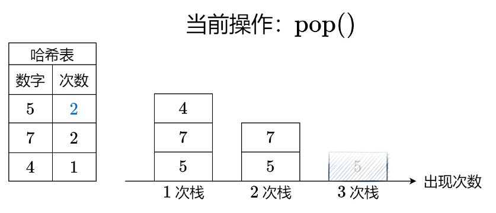

# [895. 最大频率栈](https://leetcode.cn/problems/maximum-frequency-stack/)

### 题目（困难）

设计一个类似堆栈的数据结构，将元素推入堆栈，并从堆栈中弹出**出现频率**最高的元素。

实现 `FreqStack` 类:

* `FreqStack()` 构造一个空的堆栈。
* `void push(int val)` 将一个整数 `val` 压入栈顶。
* `int pop()` 删除并返回堆栈中出现频率最高的元素。
    * 如果出现频率最高的元素不只一个，则移除并返回最接近栈顶的元素。

**示例 1：**

```
输入：
["FreqStack","push","push","push","push","push","push","pop","pop","pop","pop"],
[[],[5],[7],[5],[7],[4],[5],[],[],[],[]]
输出：[null,null,null,null,null,null,null,5,7,5,4]
解释：
FreqStack = new FreqStack();
freqStack.push (5);//堆栈为 [5]
freqStack.push (7);//堆栈是 [5,7]
freqStack.push (5);//堆栈是 [5,7,5]
freqStack.push (7);//堆栈是 [5,7,5,7]
freqStack.push (4);//堆栈是 [5,7,5,7,4]
freqStack.push (5);//堆栈是 [5,7,5,7,4,5]
freqStack.pop ();//返回 5 ，因为 5 出现频率最高。堆栈变成 [5,7,5,7,4]。
freqStack.pop ();//返回 7 ，因为 5 和 7 出现频率最高，但7最接近顶部。堆栈变成 [5,7,5,4]。
freqStack.pop ();//返回 5 ，因为 5 出现频率最高。堆栈变成 [5,7,4]。
freqStack.pop ();//返回 4 ，因为 4, 5 和 7 出现频率最高，但 4 是最接近顶部的。堆栈变成 [5,7]。
```

**提示：**

* `0 <= val <= 10`^9^
* `push` 和 `pop` 的操作数不大于 `2 * 10`^4^。
* 输入保证在调用 `pop` 之前堆栈中至少有一个元素。

### 解题思路

#### 方法：哈希表+栈

- 把频率不同的元素，压入不同的栈中；
- 每次出栈时，弹出频率最高的栈的栈顶；
- 用哈希表维护每种元素的频率。



##### 复杂度分析

- 时间复杂度：$O(1)$。
- 空间复杂度：$O(n)$。

### 代码

```java
class FreqStack {
    private Map<Integer, Integer> freq;

    private List<Deque<Integer>> stacks;

    public FreqStack() {
        freq = new HashMap<>();
        stacks = new ArrayList<>();
    }

    public void push(int val) {
        int tmp = freq.getOrDefault(val, 0);
        if (tmp == stacks.size()) {
            stacks.add(new ArrayDeque<>());
        }
        stacks.get(tmp).push(val);
        freq.put(val, tmp + 1);
    }

    public int pop() {
        int tmp = stacks.size() - 1;
        int val = stacks.get(tmp).pop();
        if (stacks.get(tmp).isEmpty()) {
            stacks.remove(tmp);
        }
        freq.put(val, freq.get(val) - 1);
        return val;
    }
}

/**
 * Your FreqStack object will be instantiated and called as such:
 * FreqStack obj = new FreqStack();
 * obj.push(val);
 * int param_2 = obj.pop();
 */
```

```java
class FreqStack {
    private Map<Integer, Integer> freq;

    private Map<Integer, Deque<Integer>> stacks;

    private int maxFreq;

    public FreqStack() {
        freq = new HashMap<>();
        stacks = new HashMap<>();
        maxFreq = 0;
    }

    public void push(int val) {
        freq.put(val, freq.getOrDefault(val, 0) + 1);
        int cnt = freq.get(val);
        stacks.computeIfAbsent(cnt, k -> new ArrayDeque<>()).push(val);
        maxFreq = Math.max(maxFreq, cnt);
    }

    public int pop() {
        int val = stacks.get(maxFreq).pop();
        if (stacks.get(maxFreq).isEmpty()) {
            maxFreq--;
        }
        freq.put(val, freq.get(val) - 1);
        return val;
    }
}

/**
 * Your FreqStack object will be instantiated and called as such:
 * FreqStack obj = new FreqStack();
 * obj.push(val);
 * int param_2 = obj.pop();
 */
```